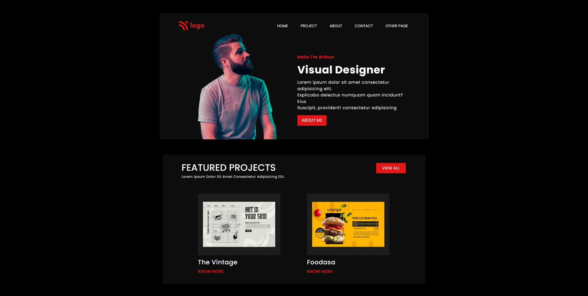
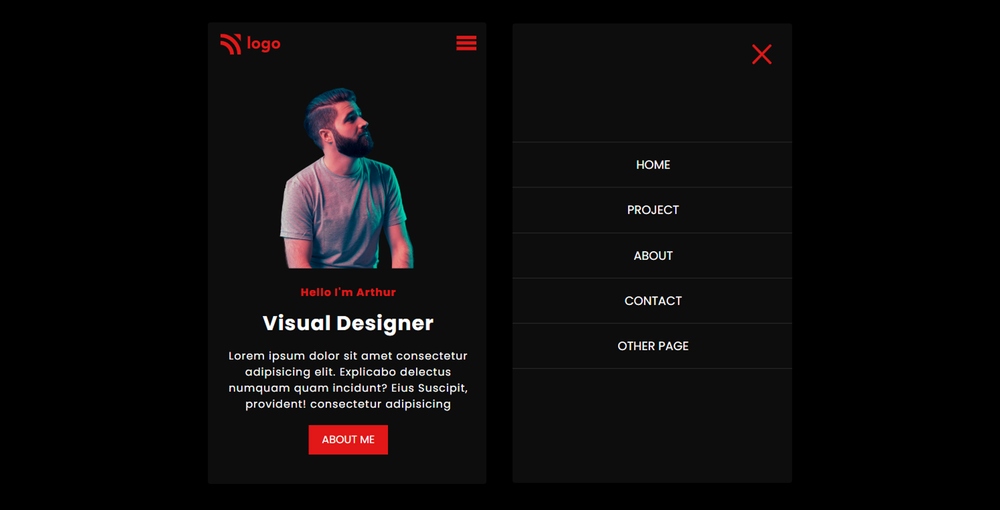

# VISUAL-DESIGN-LANDING-PAGE

## [Live Site](https://product-design-webpage.netlify.app/)

## Introduction

This is a code repository for the fully responsive Visual designer Landing Page.

## Time taken to finish this project

It took me about 6 hours to complete this project.

## What I learned from this Project?

- Learnd to use css media queries.
- Learnd to use css flex-box.
- Learnd to use css z-index.
- Learnd to use css position.
